# 기획자/마케터 역량강화를 위한 프로그래밍 camp
## Google tag manager

---
<!--
page_number: true
$size: A4
footer : 기획자/마케터 역량강화를 위한 프로그래밍 camp, Wooyoung Choi, 2018
-->

## Introduce


### 최우영
- Co-founder, Developer at disceptio
- Solution Architect, Web Developer, Instructor
- python web crawling bootcamp(gilbut, 2018 expected)
- Skills: Python, Golang, Julia, Node.js, Google tag manager ...

#### blog: https://blog.ulgoon.com/
#### github: https://github.com/ulgoon/
#### email: me@ulgoon.com

---
## javaScript from scratch

---
### javaScript란?
- 객체 기반의 스크립트 프로그래밍 언어
- 웹페이지의 동적인 제어 목적
- Netscape의 Brendan Eich가 모카(Mocha)를 개발
- LiveScript -> javaScript로 개명

---
### Static Web site - 1
<div id="dynamic-btn1" style="width:200px; height:200px; background:red;"></div>

---
### Static Web site - 2
<div id="dynamic-btn2" style="width:200px; height:200px; background:green;"></div>

---
### Static Web site - 3
<div id="dynamic-btn3" style="width:200px; height:200px; background:blue;"></div>


---
### Dynamic Web site
<div id="dynamic-btn" style="width:200px; height:200px; background:black;"></div>
<button type="button" onclick="document.getElementById('dynamic-btn').style.background='red'" style="font-size:20px;">Red</button>
<button type="button" onclick="document.getElementById('dynamic-btn').style.background='green'" style="font-size:20px;">Green</button>
<button type="button" onclick="document.getElementById('dynamic-btn').style.background='blue'" style="font-size:20px;">Blue</button>

---
### Java != javaScript

|Java|vs|javaScript|
|:--:|:--:|:--:|
|Sun|개발|Brendan Eich|
|JVM|구동방식|Script Engine(Browser)|
|C|영향|C|
|인도|Like|인도네시아|

---
### Try "hello world!"
```python
print("hello python!")
```

```javaScript
console.log("hello javaScript!");
alert("hello javaScript!");
document.write("hello javaScript!");
```
---
### variable, statements, operation
```python
a=3
b=5
c=a+b
```

```javaScript
// declare a,b,c
var a,b,c;
// assign a,b
a = 3;
b = 5;
// assign statements with + operator
c = a + b;
```

---
### functions
```python
def name(parameter1, parameter2, ..):
    # code to be executed
```
```javaScript
function name(parameter1, parameter2, ..) {
    // code to be executed
}
```

---
### functions
```python
def print_hello(name):
    print("hello, "+name)
```
```javaScript
function printHello(name) {
    console.log("hello, " + name);
}
```

---
### functions
```python
def awesum(num1, num2):
    return num1 + num2
```
```javaScript
function aweSum(num1, num2) {
    return num1 + num2;
}
```

---
## Conditional statements - if, else
```python
a = 10
if a==10:
    print("a is 10")
else:
    print("a is not 10")
```
```javaScript
var a = 10;
if (a===10){
    console.log("a is 10");
} else {
    console.log("a is not 10");
}
```

---
## Conditional statements - if in else
```python
a = 10
if a==10:
    print("a is 10")
elif a==5:
    print("a is 5")
else:
    print("a is neither 10 nor 5")
```
```javaScript
var a = 10;
if (a===10){
    console.log("a is 10");
} else if (a===5){
    console.log("a is 5");
} else {
    console.log("a is neither 10 nor 5");
}
```


---
## Conditional statements - switch
```python
Null
```
```javaScript
switch (new Date().getDay()){
    case 0:
    case 6:
        console.log("Weekend!!!");
        break;
    case 1:
    case 2:
    case 3:
    case 4:
    case 5:
        console.log("Weekday..");
        break;
}
```

---
### loop - for
```python
for i in range(1,10+1):
    print("hello for " + i + " times")
```

```javaScript
for (i = 1; i < 11; i++) { 
    console.log("hello for "+i+" times");
}
```

---
### loop - while
```python
while i<10+1:
    print("hello")
    i+=1
```
```javaScript
while (i<11){
    console.log("hello");
    i++;
}
```

---
### loop - break
```python
for i in range(1,10+1):
    if i == 5:
        break
    print("hello for "+i+" times")
```

```javaScript
for (i = 1; i < 11; i++) {
    if (i===5) {break;}
    console.log("hello for "+i+" times");
}
```

---
### loop - continue
```python
for i in range(1,10+1):
    if i%2==0:
        continue
    print("hello for "+i+" times")
```
```javaScript
for (i = 1; i < 11; i++) {
    if (i%2===0) {continue;}
    console.log("hello for "+i+" times");
}
```
---
### =? ==? ===??

- `=`: Assignment Operator(`a=10`)
- `==`: Equal Operator(`1=="1"`)
- `===`: Strict Equal Operator(`1==="1"`)

---
## Google tag manager

---
### What is Google tag manager?


---


---
### Let's get started!
## GTM 설치 부터 GA Implementation 까지

---
## Requirements
- Chrome Extensions
	- [Google Tag Assistant](https://chrome.google.com/webstore/detail/tag-assistant-by-google/kejbdjndbnbjgmefkgdddjlbokphdefk)
		- tag가 올바르게 동작하고 있는지 확인하기 위함
	- [Web Developer](https://chrome.google.com/webstore/detail/web-developer/bfbameneiokkgbdmiekhjnmfkcnldhhm)
		- 웹 관련 다양한 기능들을 간편하게 조작할 수 있도록 도와주는 도구

---
## Sign up
[google tag manager](https://tagmanager.google.com/)
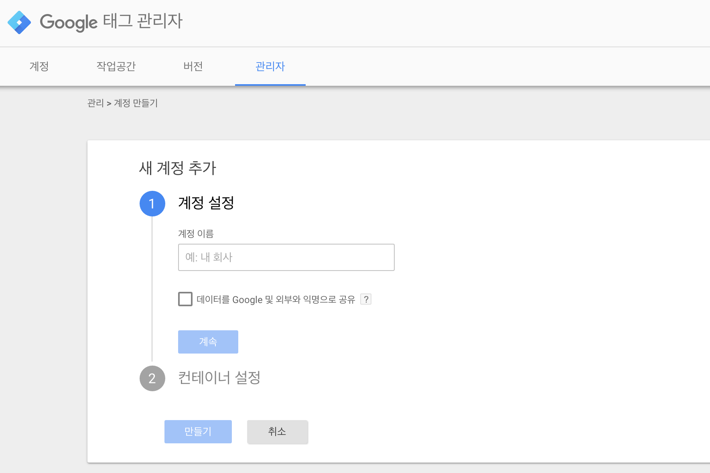

---
## Sign up
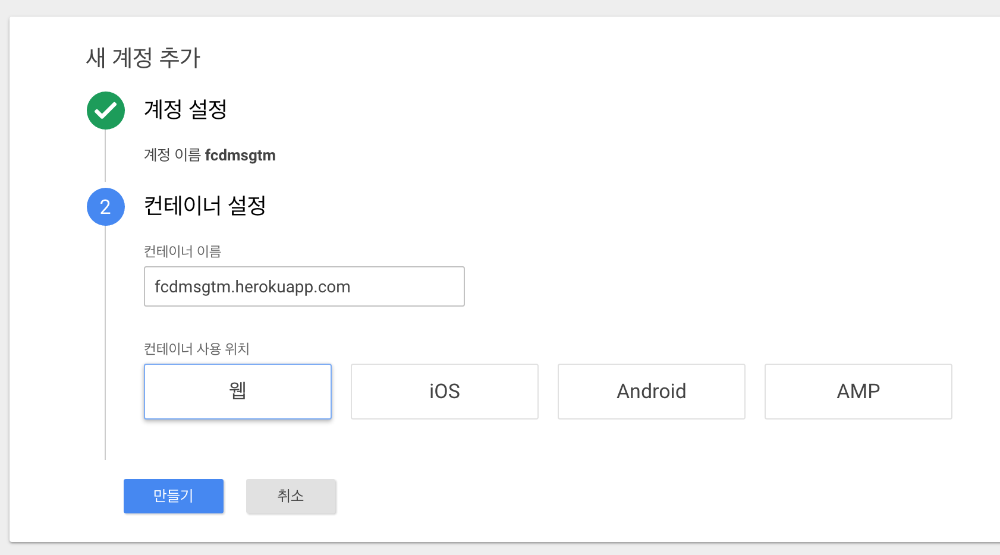

---
## Sign up
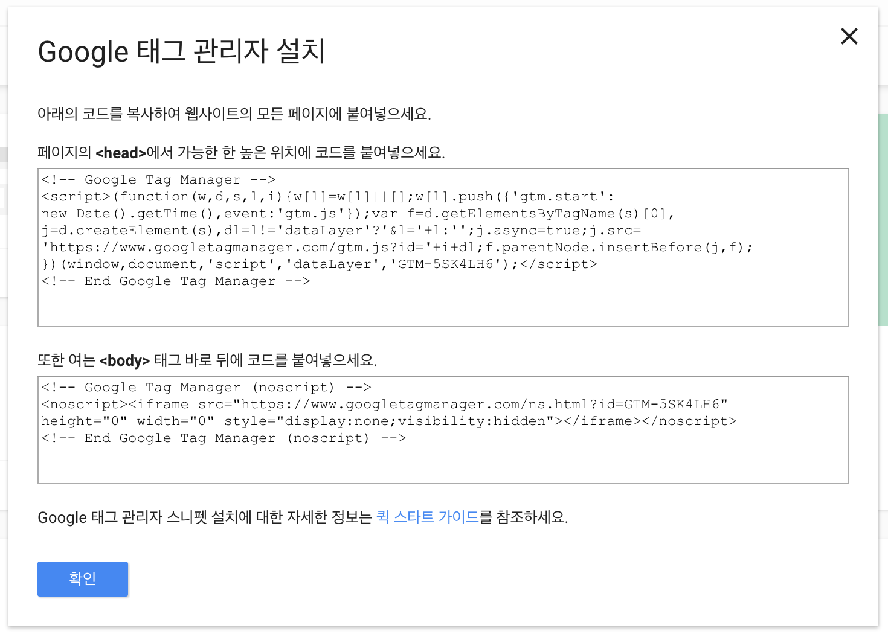

---
## Success!
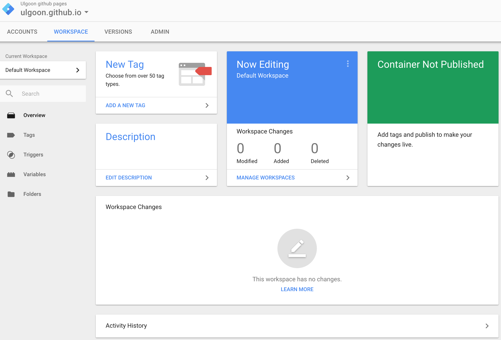

---
## User-defined variable
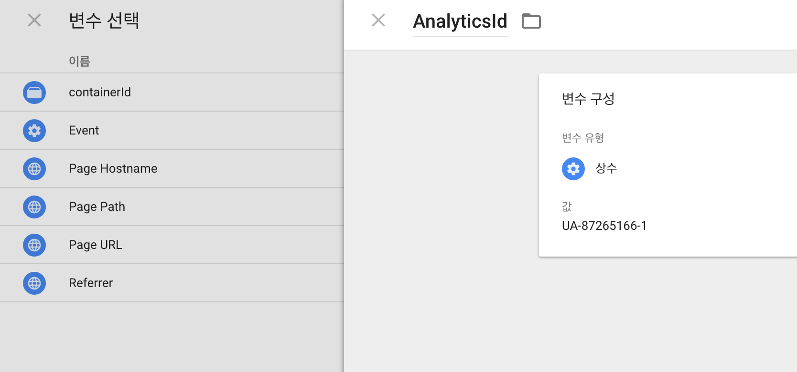

---
## User-defined variable
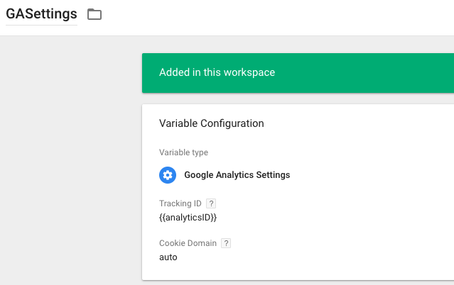

---
## Create tag GA - Page View - All Pages
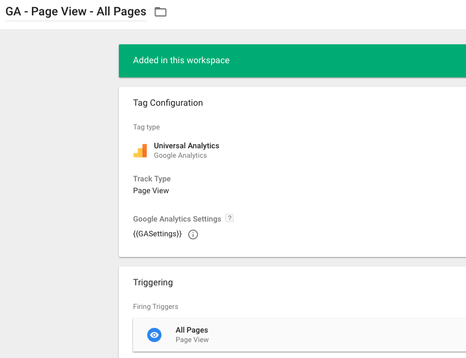

---
## GA Implementation Success!
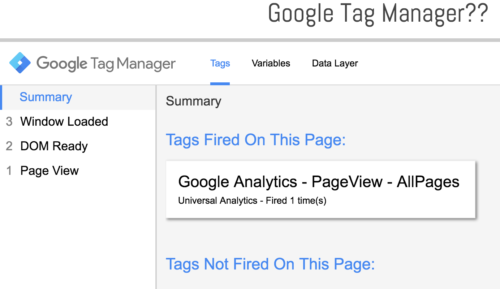

---
## DOM Ready vs Window loaded
1. Pageview
2. DOM Ready
	- DOM 이 로드되어 처리됨(js event)
```
$(document).ready(function() {
 alert("document is ready");
});
```
3. Window loaded
	- 모든 리소스가 로드된 후 처리됨(웹페이지 로딩 완료 ,js event)
```
$(window).load(function() {
 alert("window is loaded");
});
```

---
## DOM
Document Object Model

```html
<!doctype html>
<html>
 <head>
  <meta charset="utf-8">
  <title>My page</title>
 </head>
 <body>
  <h1>Home</h1>
  <p>Hello there!</p>
 </body>
</html>
```

---
## DOM
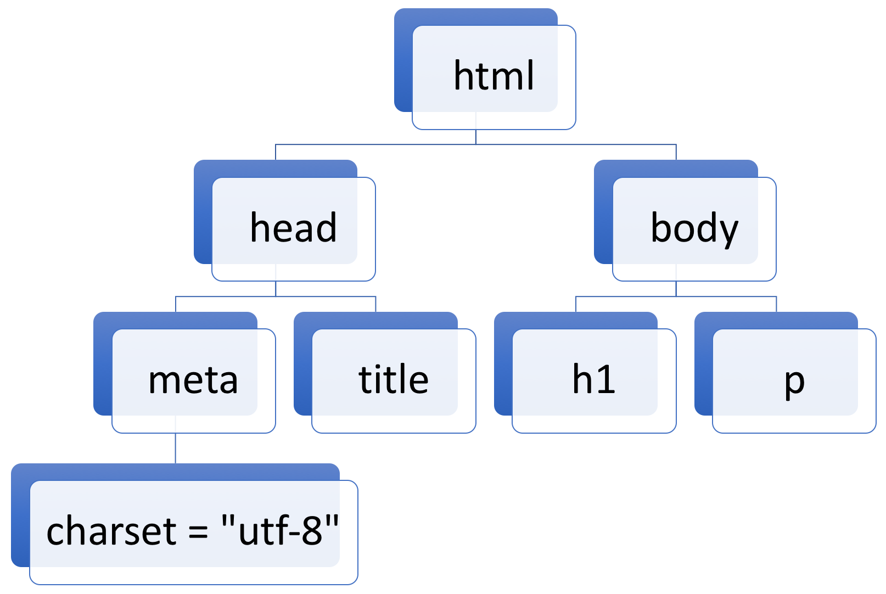

---
### Google Tag Manager Diagram
- Account
	- Container
		- Tag
			- Trigger
			- Variable 

---
### Tags
- 페이지에서 실행되는 Code Snippet
- 수집된 정보를 외부로 전송하는 역할
- 정의된 트리거에 대해 상호작용

---
### Triggers
- 참 또는 거짓을 판별하는 요소
- 변수와 트리거의 조건과 비교를 통해 판별
- 데이터 레이어 없이도 트리거 작동 가능
	- 개발 요소를 줄이기 위한 노력 

---
### Triggers - 구성요소
- Variables
	- 트리거가 작동하기 위한 변수
	- [Built-in](https://support.google.com/tagmanager/answer/7182738?hl=ko&ref_topic=7182737), User-defined
	- placeholder, "x", {{}}
- Operators
	- 트리거가 작동하기 위한 조건
	- equals, contains, doesn't contain
- Values
	- 기준값

ex) {{url}} equals about.html


---
### Variables
- 다양한 옵션과 방법으로 변수를 저장하고 사용할 수 있음
- {{AnalyticsID}} = UA-XXXXX-XX ...

```
<script>
	function{ ... }
</script>
```

---
### Data Layer
- Google Tag Manager에 전달하려는 변수와 값을 담고 있는 객체

```
<script>
	dataLayer =[{
    	'variable':'value',
        'variable':'value'
	}];
</script>

<!-- Start Google Tag Manager -->
...
<!-- End Google Tag Manager -->
```

---
## Google Tag Manager Flow
0. Google Tag Manager code snippet을 추가한다.
1. (개발자에게 데이터레이어를 추가해달라고 한다.)
2. 변수와 트리거를 생성한다.
3. 태그를 생성한다.
4. Preview를 통해 정상동작을 확인한다.
5. Deploy!
6. 데이터를 수집한다.

---
## Version

---
### GA Click Event Tag

---
### GA Event vs GTM Event

GA
- Endpoint
- GTM을 통해 발사된 UA 태그의 결과값

GTM
- dataLayer checkpoint
- datalayer로 푸시되는 웹페이지 요소들의 종류
- 트리거를 설정하는데 쓰임


---
### Create Ceneric Click Trigger

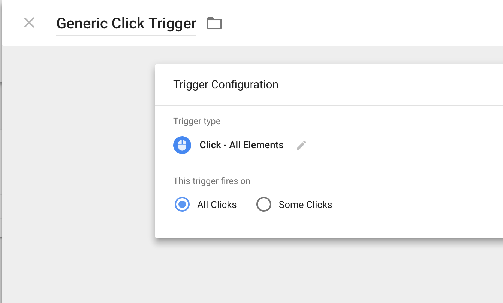

---
### Activate Built-in Click Variables

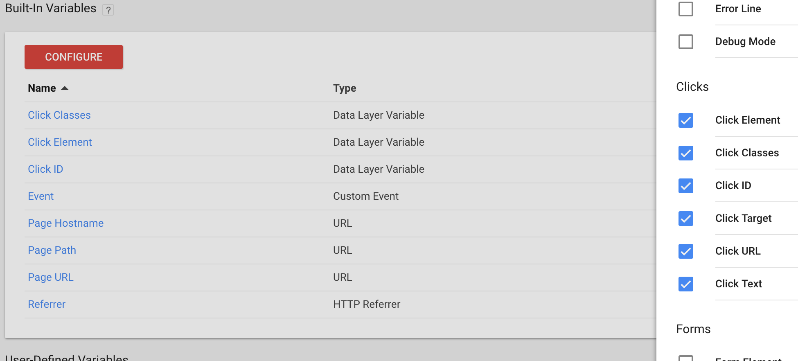

---
### Check variables

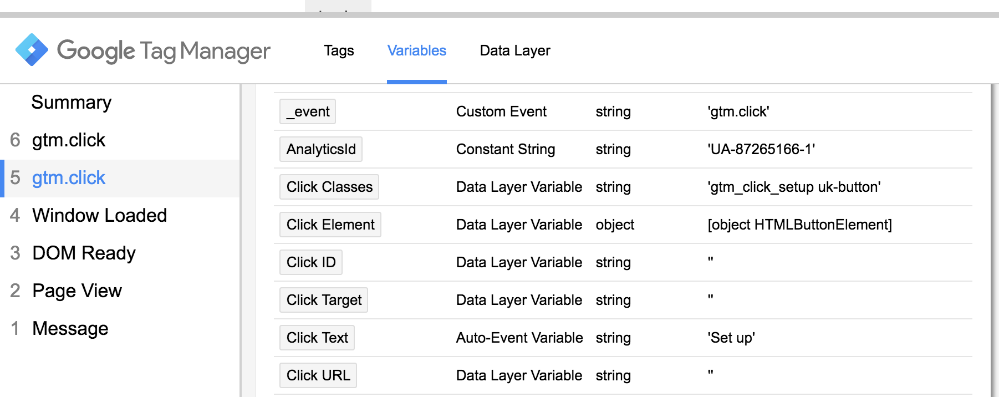

---
### Check Data layer

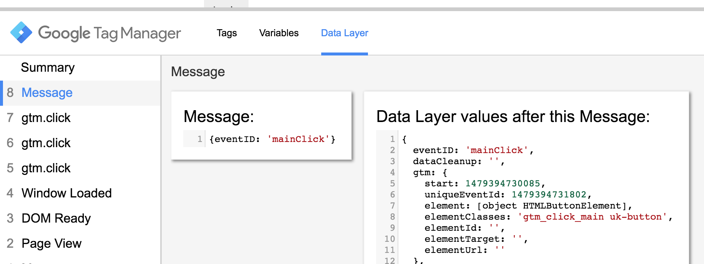

---
### Create Specific Click Trigger

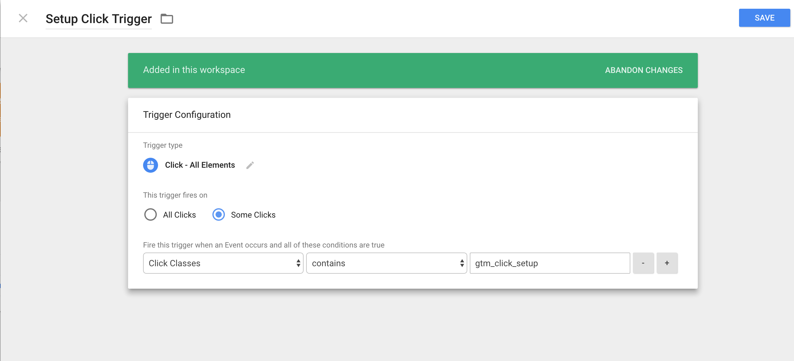

---
### Triggers Done!

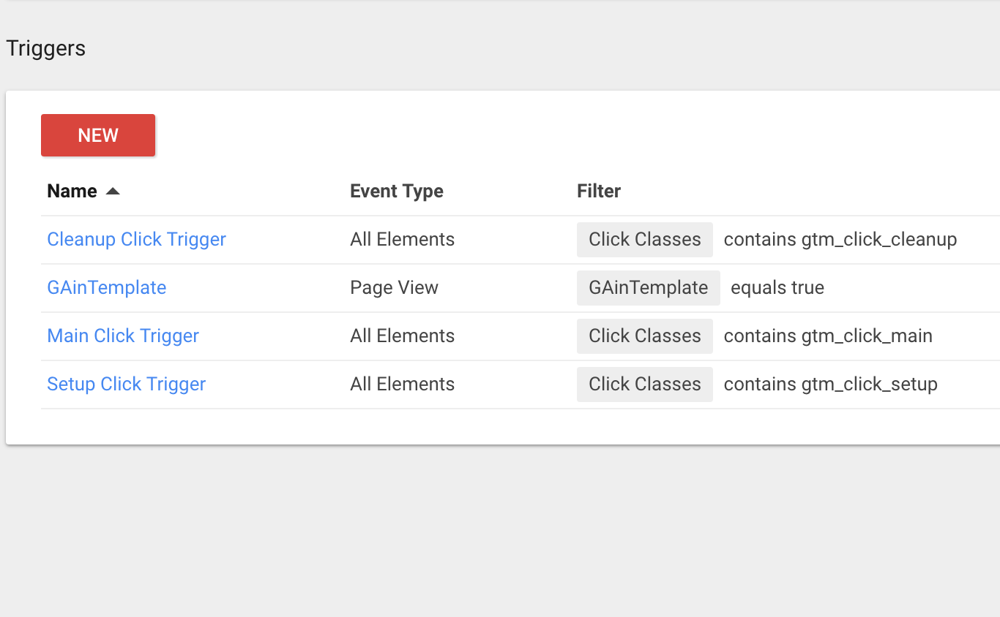

---
### Create Click Event

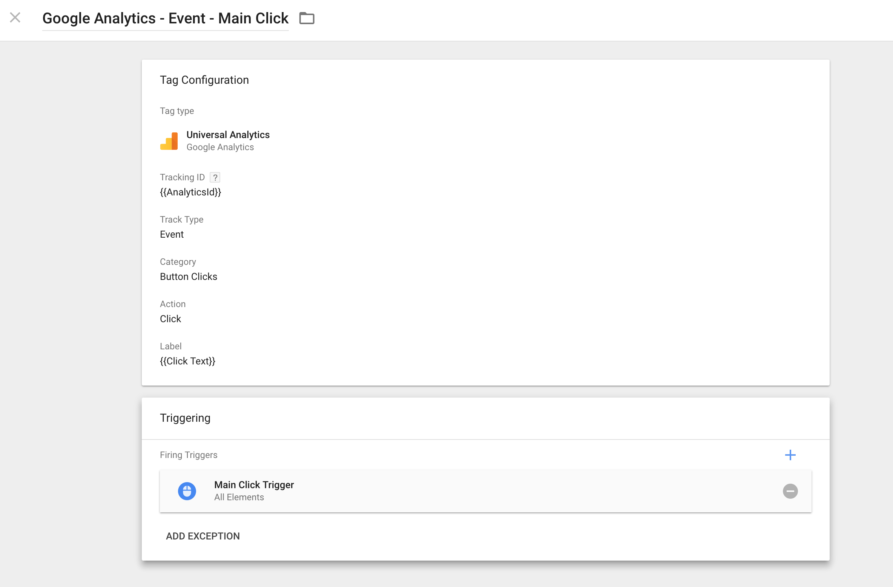

---
### Preview & Check GA

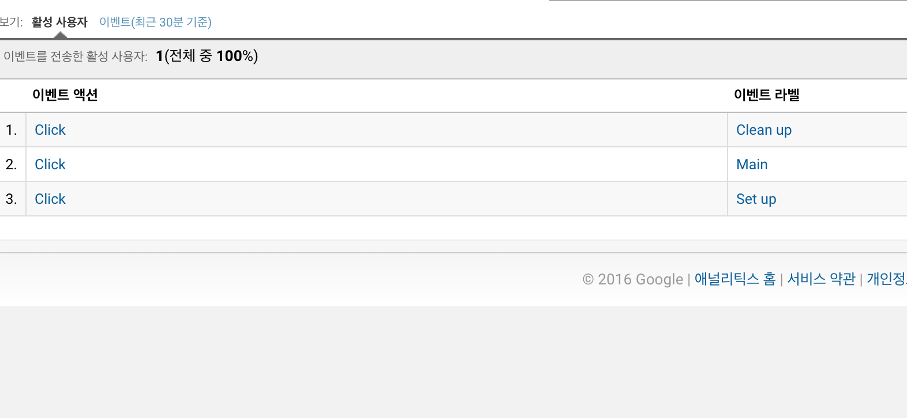


---
## Brand New Scroll Depth Tracking

---
## Brand New Scroll Depth Tracking
### Scroll 관련 변수를 활성화!
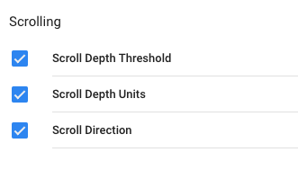

---
## Brand New Scroll Depth Tracking
### Scroll Depth로 트리거를 생성!
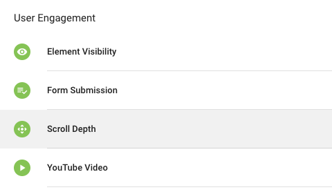

---
## Brand New Scroll Depth Tracking
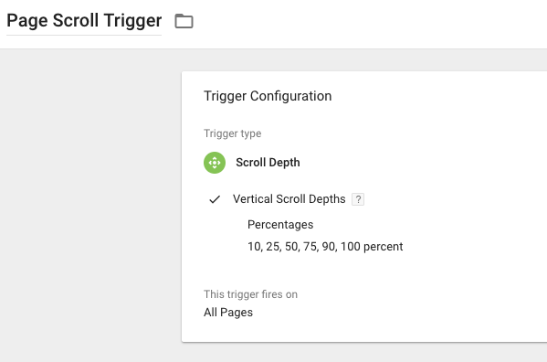

---
## Brand New Scroll Depth Tracking
### gtm.scrollDepth 이벤트를 확인하고
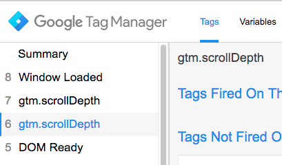

---
## Brand New Scroll Depth Tracking
### 관련 변수들에 쌓이는 값을 확인한 뒤,
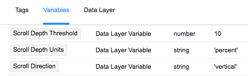

---
## Brand New Scroll Depth Tracking
### GA 태그를 생성!
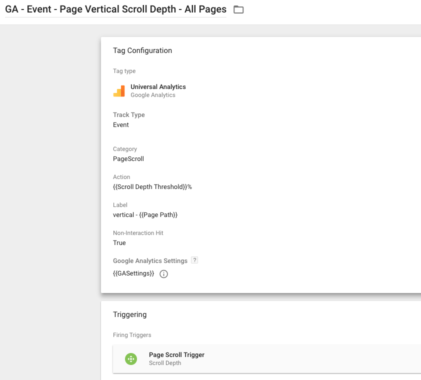