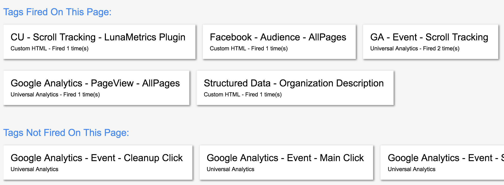
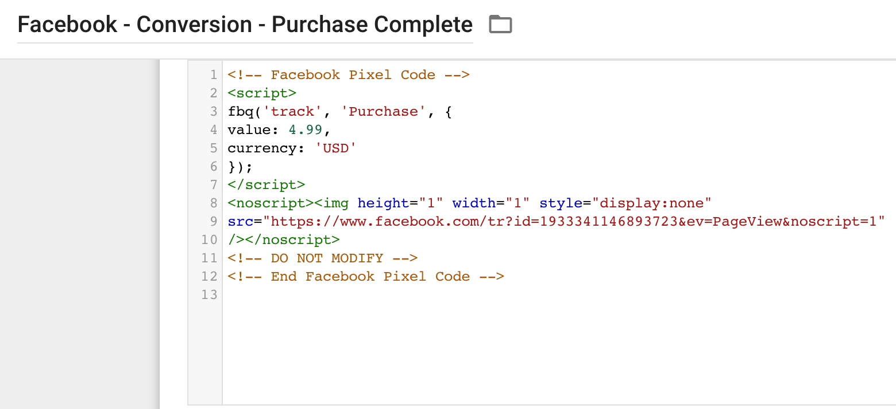

# 기획자/마케터 역량강화를 위한 프로그래밍 camp
## Google tag manager

---
<!--
page_number: true
$size: A4
footer : 기획자/마케터 역량강화를 위한 프로그래밍 camp, Wooyoung Choi, 2018
-->

## Recap
- javaScript Basic
- Google Tag Manager
	- GA Pageview
	- GA Click Event
	- GA Scroll Event

---
## Index
- javaScript HTML DOM
- Facebook Pixel(Audience to Conversion)
- Adwords Script(Countdown, Pause Keywords)

---
### javaScript HTML DOM

---
## DOM
Document Object Model

```html
<!doctype html>
<html>
 <head>
  <meta charset="utf-8">
  <title>My page</title>
 </head>
 <body>
  <h1>Home</h1>
  <p>Hello there!</p>
 </body>
</html>
```

---
## DOM


---
## with HTML DOM, javaScript can ..
- HTML 요소, 속성 생성, 변경, 삭제
- HTML 이벤트 수행
- CSS 스타일 변경

---
## HTML Document Object
- window는 브라우저의 탭 또는 창을 의미합니다.
- document는 웹페이지의 모든 요소의 소유자입니다.
- element는 document의 하위 요소를 의미합니다.
- attribute는 element의 속성을 의미합니다.
---
### Set document
```html
<!doctype html>
<html>
 <head>
  <meta charset="utf-8">
  <title>DOM Practice</title>
 </head>
 <body>
 <div id="container">
  <h1 id="article-title"></h1>
  <p class="article-text"></p>
 </div>
 </body>
</html>
```

---
### Find Element
```javaScript
document.getElementById(id)
document.getElementsByTagName(tagname)
document.getElementsByClassName(classname)
```
```javaScript
var mainArticle = document.querySelectorAll("div.main-article");
```


### Change Element
```javaScript
element.innerHTML = 'new content'
element.{{attribute}} = 'new value'
element.setAttribute(attribute, value)
element.style.{{property}} = 'new style'
```

---
### Add Element
```javaScript
document.createElement(element)
document.appendChild(element)
document.write(text)
```

### Replace and Delete Element
```javaScript
document.replaceChild(element)
document.removeChild(element)
```

---
### DOM Event
Mouse Event
```javaScript
onclick

onmouseover
onmouseout

onmousedown
onmouseup
```

---
### DOM Event
Keyboard Event
```javaScript
onkeypress

onkeyup
onkeydown
```
<script>
function kpLower(){
var x = document.getElementById("kpInput");
x.value = x.value.toLowerCase();
}
function kuUpper(){
var x = document.getElementById("kuInput");
x.value = x.value.toUpperCase();
}
</script>
<input id="kpInput" onkeypress="kpLower()">
<input id="kuInput" onkeypress="kuUpper()">


---
### DOM Event
Form Event
```javaScript
onchange

oninput

onselect

onsubmit
```
<script>
function chUpper() {
    var x = document.getElementById("chInput");
    x.value = x.value.toUpperCase();
}
function showInput() {
    var x = document.getElementById("shInput").value;
    document.getElementById("showcase").innerHTML = "You mean: " + x;
}
</script>
<form>
<input id="chInput" onchange="chUpper()">
<input id="shInput" oninput="showInput()">
<p id="showcase"></p>
</form>


---
### Add Event Handler
```javaScript
element.onclick = function(){alert('hello')}
```
### Add Event Listener 
```javaScript
element.addEventListener("click", function(){alert('hello')});
```

---
## Facebook - Audience to Conversion

---
### Facebook implementation

[chrome pixel helper](https://chrome.google.com/webstore/detail/facebook-pixel-helper/fdgfkebogiimcoedlicjlajpkdmockpc)

---
### Facebook implementation


---
### Facebook implementation


---
### Facebook implementation



---
### Facebook implementation


---
### Facebook implementation


---
### Facebook Conversion Tracking

---
### Facebook Conversion Tracking

[reference](https://www.facebook.com/business/help/1662592027337096?helpref=related)

|웹사이트 행동|설명| 표준 이벤트 코드|
|:----------:|:-:|:-------------:|
|주요 페이지 조회|주요 페이지 조회 추적(예: 제품 페이지, 랜딩 페이지, 기사)|fbq('track', 'ViewContent');|
|검색|웹사이트 내 검색 추적(예: 제품 검색)|fbq('track', 'Search');|


---
### Facebook Conversion Tracking

|웹사이트 행동|설명| 표준 이벤트 코드|
|:----------:|:-:|:-------------:|
|장바구니에 담기|장바구니에 상품이 담기면 추적(예: 장바구니에 담기에 대한 클릭, 랜딩 페이지)|fbq('track', 'AddToCart');|
|위시리스트에 추가|위시리스트에 상품이 추가되면 추적(예: 위시리스트에 담기에 대한 클릭, 랜딩 페이지)|fbq('track', 'AddToWishlist');|
|결제 시작|결제 플로가 시작되면 추적(예: 결제 버튼에 대한 클릭, 랜딩 페이지)|fbq('track', 'InitiateCheckout');|

---
### Facebook Conversion Tracking

|웹사이트 행동|설명| 표준 이벤트 코드|
|:----------:|:-:|:-------------:|
|결제 정보 추가|결제 플로에 결제 정보가 추가되면 추적(예: 청구 정보에 대한 클릭, 랜딩 페이지)|fbq('track', 'AddPaymentInfo');|
|구매|구매 또는 결제 플로 완료 추적(예: "감사합니다" 또는 확인 페이지 랜딩)|fbq('track', 'Purchase', {value: '0.00', currency: 'USD'});|

---
### Facebook Conversion Tracking

|웹사이트 행동|설명| 표준 이벤트 코드|
|:----------:|:-:|:-------------:|
|잠재 고객|누군가 상품에 관심을 표현하면 추적(예: 양식 제출, 체험판 등록, 가격 페이지 랜딩)|fbq('track', 'Lead');|
|등록 완료|등록 양식이 작성되면 추적(예: 구독 완료, 서비스 가입)|fbq('track', 'CompleteRegistration');|


---
### Facebook Conversion Tracking


---
### Facebook Conversion Tracking

```
<!-- Facebook Pixel Code -->
<script>
fbq('track', 'ViewContent', {
value: 4.99,
currency: 'USD'
});
</script>
<noscript></noscript>
<!-- DO NOT MODIFY -->
<!-- End Facebook Pixel Code -->
```


---
### Facebook Conversion Tracking


---
### Facebook Conversion Tracking


---
### Facebook Conversion Tracking


---
### Facebook Conversion Tracking


---
### Facebook Conversion Tracking


---
### Facebook Conversion Tracking


---
### Facebook Conversion Tracking


---
### Facebook Conversion Tracking


---
### Facebook Conversion Tracking


---
### Facebook Conversion Tracking



---
### Facebook Conversion Tracking


---
### Facebook Conversion Tracking


---
## Adwords Customize

---
## Start Adwords Script


---
## Start Adwords Script


---
## Start Adwords Script


---
## Start Adwords Script


---
## Start Adwords Script


---
## 10 keywords with most impressions yesterday

```javaScript
function main() {
  var keywords = AdWordsApp.keywords()
      .orderBy("Impressions DESC")
      .forDateRange("YESTERDAY")
      .withLimit(10)
      .get();

  Logger.log("10 keywords with most impressions yesterday");
  while (keywords.hasNext()) {
    var keyword = keywords.next();
    Logger.log(keyword.getText() + ": " +
        keyword.getStatsFor("YESTERDAY").getImpressions());
  }
}
```


---
## See result!


---
## Count Down - Add New Campaign


---
## Count Down - Add New Campaign


---
## Count Down - Add New Campaign


---
## Count Down - Add New Campaign


---
## Count Down - Add New Campaign


---
## Count Down - Add New Campaign


On Headline1 or Headline2
`{param1:few} for days and {param2:&} for hours`

---
## Count Down - Create New Scripts


---
## Count Down - Set END_DATE and AD_GROUP_NAME
```javaScript
var END_DATE = new Date('April 11, 2018');

var AD_GROUP_NAME = 'testAds3';
```

---
## Count Down - Set day to ms
```javaScript
var DAY_IN_MILLISECONDS = 1000*60*60*24;
```


---
## Count Down - get Ad Group
```javaScript
function getAdGroup(name) {
 var adGroupIterator = AdWordsApp.adGroups()
   .withCondition('Name = "' + name + '"')
   .withLimit(1)
   .get();
 if (adGroupIterator.hasNext()) {
  return adGroupIterator.next();
 }
}
```

---
## Count Down - calculate countdown time
```javaScript
function calculateTimeLeftUntil(end) {
 var current = new Date();
 var timeLeft = {};
 var daysFloat = (end - current) / (DAY_IN_MILLISECONDS);
 timeLeft['days'] = Math.floor(daysFloat);
 timeLeft['hours'] = Math.floor(24 * (daysFloat - timeLeft['days']));
 return timeLeft;
}
```

---
## Count Down - main function
```javaScript
function main() {
 var timeLeft = calculateTimeLeftUntil(END_DATE);
 var adGroup = getAdGroup(AD_GROUP_NAME);
 var keywords = adGroup.keywords().get();
 while (keywords.hasNext()) {
  var keyword = keywords.next();

  keyword.setAdParam(1, timeLeft['days']);
  keyword.setAdParam(2, timeLeft['hours']);
   
 }
}
```

---
## Count Down - boost up
```javaScript
function main() {
 var timeLeft = calculateTimeLeftUntil(END_DATE);
 var adGroup = getAdGroup(AD_GROUP_NAME);
 var keywords = adGroup.keywords().get();
 while (keywords.hasNext()) {
  var keyword = keywords.next();
  // We want to update {param1} to use our calculated days and {param2} for hours.
  keyword.setAdParam(1, timeLeft['days']);
  keyword.setAdParam(2, timeLeft['hours']);
   if (timeLeft['days'] < 5) {
  keyword.setMaxCpc(keyword.getTopOfPageCpc());
 } else {
  keyword.setMaxCpc(keyword.getFirstPageCpc());
 }
 }
}
```

---
## Count Down - Ad param added => Success


---
## Pause Keywords

```javaScript
var TO_NOTIFY = "your@email.com";
function main() {
  
  var kwIter = AdWordsApp.keywords()
    .withCondition("Impressions = 0") 
    .forDateRange("ALL_TIME") 
    .withCondition("Status = ENABLED")
    .withCondition("CampaignStatus = ENABLED")
    .withCondition("AdGroupStatus = ENABLED")
    .get();
    
  var toPause = [];
```

---
## Pause Keywords

```javaScript    
  while (kwIter.hasNext()) {
    var kw = kwIter.next();
    toPause.push(kw);
    
    if(AdWordsApp.getExecutionInfo().isPreview() &&
       AdWordsApp.getExecutionInfo().getRemainingTime() < 10) {
      break;
    }
  }
   
  for(var i in toPause) {
    toPause[i].pause();
  }
```

---
## Pause Keywords

```javaScript 

  MailApp.sendEmail(TO_NOTIFY, 
                    "AdWords Script Paused "
                    +toPause.length
                    +" Keywords.", 
                    "Your AdWords Script paused "
                    +toPause.length
                    +" keywords.");
}
```